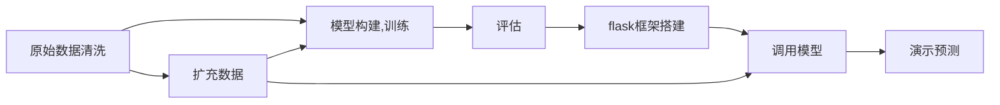
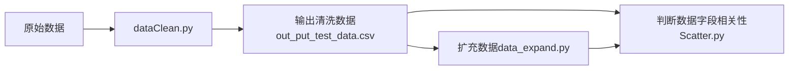

# roadTrafficForcast

## 1、项目架构介绍
### 1.1、基本架构
`\roadTrafficForcast        根目录
+--readme.md                提示文档
+--code/                    主要代码
   +--dataClean/               清洗代码
   +--graphs/                  绘图
   +--model/                   模型代码
   +--Traffic_Data/            数据
+--images/                  其他图像
+--venv/
+--webapp/                  flask框架根目录
   +--data/                    演示用数据，与前面同名数据一致
   +--model/                   训练输出模型，供flask项目调用
   +--static/              flask项目静态数据
   +--templates/           页面模板`
### 1.2、详细架构
`\roadTrafficForcast        根目录
+--readme.md                提示文档
+--code/                    主要代码
   +--dataClean/               清洗代码
      +--dataClean.py            数据清洗代码
      +--data_expand.py          数据扩充代码
      +--Scatter.py              判断数据字段相关性代码
   +--graphs/                  绘图
      +--concreate.py            将lstm、gru预测数据与真实数据Flow合并
      +--data_out.py             动态时间步生成的lstm、gru预测数据
      +--Flow-vs-Avg_kph.png     判断数据字段相关性代码输出的图像
      +--GRU_static_3Day.png     GRU静态时间步三日预测图
      +--LSTM_GRU_dynamic_12H.png    LSTM、GRU动态时间步12小时预测图
      +--LSTM_static_3Day.png    LSTM静态时间步三日预测图
      +--merged_file.csv         concreate.py输出的合并文件
      +--model_graph.py          绘制图像
      +--result.csv              data_out.py输出的文件
   +--model/                   模型代码
      +--model_param.py          交叉验证获取模型参数（模型修改迭代后忘了更新，可能不可用）
      +--model_train.py          模型训练代码
   +--Traffic_Data/            数据
      +--DailyStandard_Report_1_8978_01_04_2019_31_05_2019.csv   原始数据
      +--output_test_data.csv    清洗输出数据
      +--output_test_data_expand.csv 扩充输出数据
+--images/                  其他图像
   +--GRU.png
   +--LSTM.png
   +--other/
+--venv/
+--webapp/                  flask框架根目录
   +--app.py                   用于演示静态时间步预测效果
   +--appDemo.py               用于演示动态时间步预测效果
   +--Procfile
   +--data/                    演示用数据，与前面同名数据一致
      +--output_test_data_expand.csv     扩充输出数据
      +--output_test_data_expand_Demo.csv    扩充输出数据，用于演示动态时间步
   +--model/                   训练输出模型，供flask项目调用
      +--GRU.h5                  
      +--GRU_loss.csv
      +--LSTM.h5
      +--LSTM_loss.csv
   +--static/              flask项目静态数据
      +--GRU_static_3Day.png
      +--logo.png
      +--LSTM_GRU_dynamic_12H.png
      +--LSTM_static_3Day.png
   +--templates/           页面模板
      +--index.html`
## 2、环境及外部库要求（仅展示主要的库,完整库请看requirements.txt文档）
`python3.11
Flask	2.2.3
keras	2.12.0rc1
matplotlib	3.7.1	
numpy	1.24.2
pandas	2.0.1	
pip	23.0.1
requests	2.28.2
scikit-learn	1.2.2
tensorflow	2.12.0rc1	
tensorflow-estimator	2.12.0rc0	
tensorflow-intel	2.12.0rc1	
tensorflow-io-gcs-filesystem	0.31.0
`
## 3、代码执行流程介绍
### 3.1、整体流程

### 3.2、清洗代码

### 3.3、模型训练及评估
 ```mermaid
graph LR;
    扩充数据-->模型构建,交叉验证获得最佳模型参数model_param.py-->训练模型-->评估模型
    清洗数据-->模型构建,交叉验证获得最佳模型参数model_param.py
    评估模型-->绘制静态时间步预测结果图
 ```
### 3.4、预测
 ```mermaid
graph LR;
    扩充数据-->静态时间步演示预测结果app.py-->演示预测
    扩充数据-->动态时间步演示预测结果appDemo.py-->演示预测
    扩充数据-->动态时间步预测结果用于绘图data_out.py-->合并真实数据concreate.py-->绘制动态时间步预测结果图
 ```
## 4、其他说明
### 4.1、数据说明
&ensp;&ensp;&ensp;&ensp;生成的同名数据文件内容相同，../webapp/data/output_test_data_expand_Demo.csv以及../../webapp/data/output_test_data_expand_Demo.csv路径下的数据会根据预测结果动态扩充。
```python
for i in range(lag, len(data)):
    if i < 14105:  # 0.8->4703  # 这行代码使得数据从2019-05-20 00:00开始变成测试集
     #并且该代码会影响绘图效果，因为预测数据和真实数据之间产生了位移
        train.append(data[i - lag: i + 1])
    else:
        test.append(data[i - lag: i + 1])
```
### 4.2、代码说明
```python
# model_graph.py
lstm = load_model('../../webapp/model/LSTM.h5')
gru = load_model('../../webapp/model/GRU.h5')
# models以及names参数建议每次仅输入gru或lstm的一个，否则会导致绘制的图像使用的是同一个模型，这个bug我就不修改了
models = [gru]  #lstm,
names = ['GRU']  #'LSTM',
y_test = denormalize_data(y_test, flow_scaler)
y_preds = []
for name, model in zip(names, models):
    x_test = np.reshape(x_test, (x_test.shape[0], x_test.shape[1], 2))
    predicted = model.predict(x_test)
    predicted = denormalize_data(predicted, flow_scaler)
    y_preds.append(predicted)
    print(name)
# print(y_test[: 288]) # 定位app.py预测数据点位14109
# 分别调用模型去绘制两幅图结合两种模型绘制静态数据三天

# plot_LSTM_oneDay(y_test[: 864], y_preds[: 864])  # 三天的静态时间步预测，
plot_GRU_oneDay(y_test[: 864], y_preds[: 864])
```